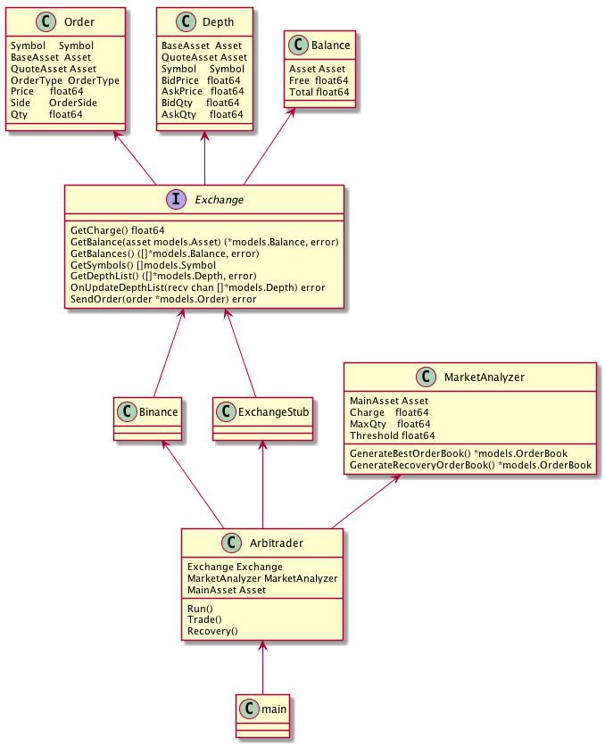
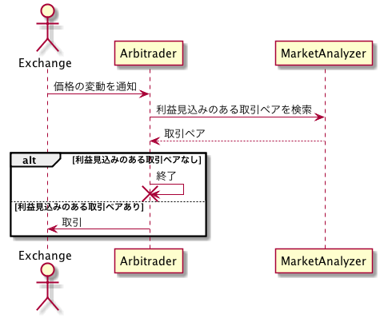

# arbitgo

単一取引所 - 複数通貨によるアービットラージを実施するBOT

## 使い方

```
$ arbitgo
NAME:
   arbitgo - A Bot for arbit rage with one exchange, multi currency

USAGE:
   main [global options] command [command options] [arguments...]

VERSION:
   0.0.1

COMMANDS:
     help, h  Shows a list of commands or help for one command

GLOBAL OPTIONS:
   --dryrun, -d                 dry run mode
   --apikey value, -a value     api key of exchange [$EXCHANGE_APIKEY]
   --secret value, -s value     secret of exchange [$EXCHANGE_SECRET]
   --help, -h                   show help
   --version, -v                print the version
```

## 取引所

- Binance

以下の基準で今後の対応取引所の選定を行う。

- 出来高
- 通貨の種類
- サーバーの耐久性
- APIの潤沢性

直近24hの出来高は以下から確認できる。

https://coinmarketcap.com/exchanges/volume/24-hour/

## 設計

### ベースアルゴリズム


以下のページで紹介されている複数通貨によるアービットラージをベースアルゴリズムとする。

http://25-500.com/3cryptocurrency-arbitrage/

### 思想

クリーンアーキテクチャをベースとした設計とする。  

http://postd.cc/golang-clean-archithecture/

### クラス図



[Link](doc/uml/class.pu)

### シーケンス図

#### ベースシーケンス



[Link](doc/ml/base_seq.pu)
