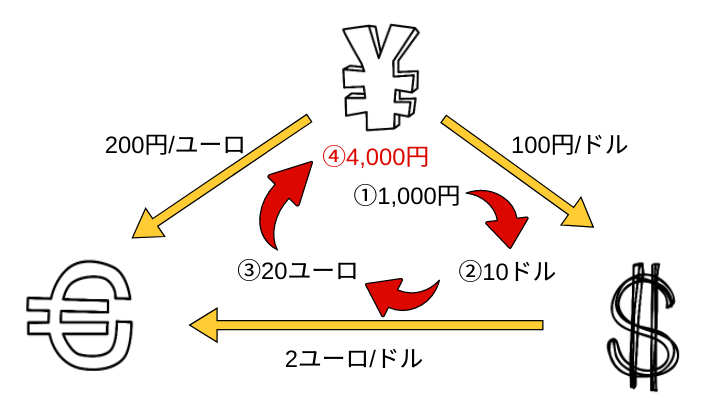

# arbitgo

単一取引所 - 複数通貨によるアービットラージを実施するBOT

## 使い方

```
$ arbitgo

Usage:
  arbitgo exchange [flags]

Flags:
  -h, --help              help
  -d, --dry               dry run
  -k, --key api_key       api key of exchange
  -s, --secret api_secret api secret of exchange
  -v, --version           print version
```

## 取引所

- Binance

以下の基準で今後の対応取引所の選定を行う。

- 出来高
- 通貨の種類
- サーバーの耐久性
- APIの潤沢性

直近24hの出来高は以下から確認できる。

https://coinmarketcap.com/exchanges/volume/24-hour/

## 設計

### ベースアルゴリズム



以下のページで紹介されている複数通貨によるアービットラージをベースアルゴリズムとする。

http://25-500.com/3cryptocurrency-arbitrage/

### 思想

クリーンアーキテクチャをベースとした設計とする。  

http://postd.cc/golang-clean-archithecture/

### クラス図

[ここに置く](uml/class.pu)

### シーケンス図

- [ベースシーケンス](uml/base_seq.pu)
- [取引シーケンス](uml/trade_seq.pu)
